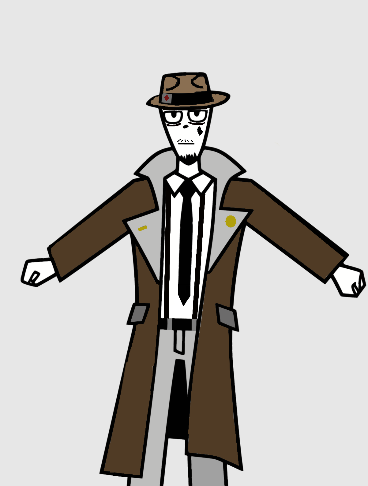
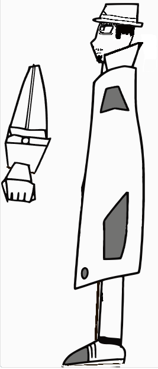
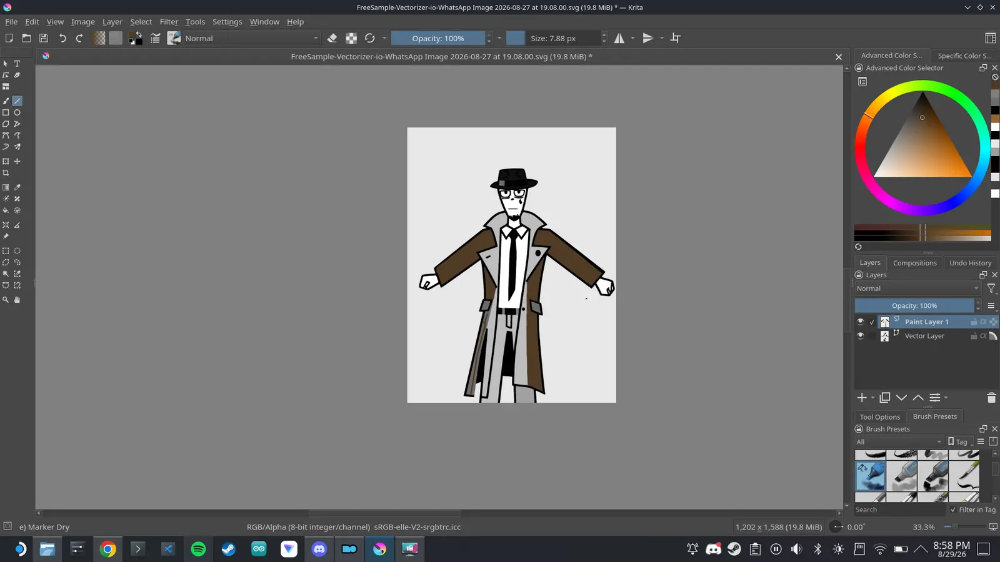
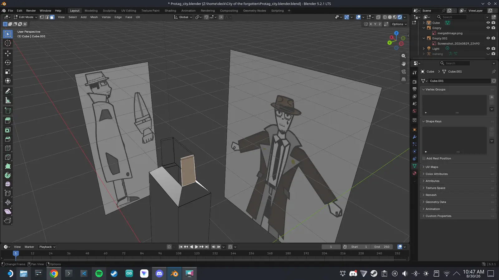
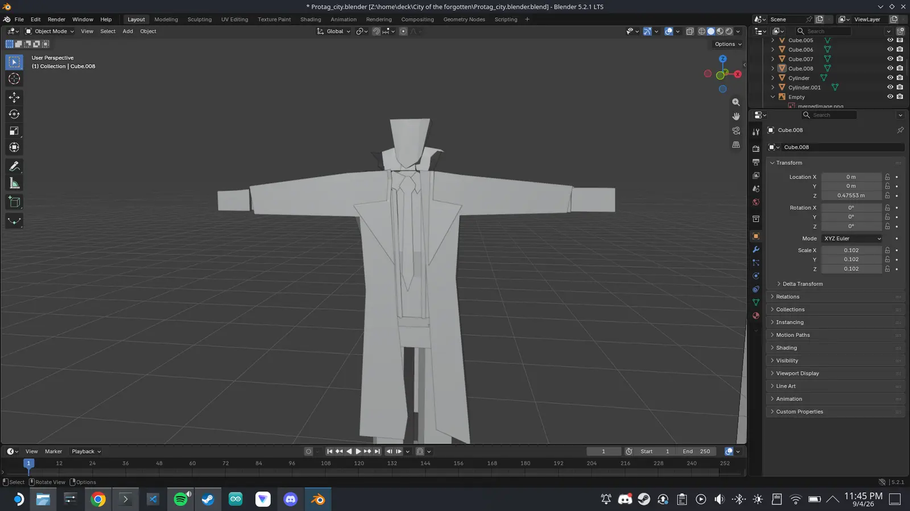

# Modeling-Assets-for-City-of-the-Forgotten-my-project-

## My Creative process

### The First Step to Make a LowPoly 3d Model it's to have Reference Pictures to model your blender model after one In front of the character and one on the side profile of the character 

But I Didn't Have any Reference Pictures So I made my Own on paper 

<i>Concept Art (Front and Side profile)</i>

 

### Digitalizing the Reference
After making the concept art, I had to transfer it to my PC to import into Blender as a reference background.

  

<i>Reference setup and digitalizing process</i>

 

## Modeling in Blender
### Digitalizing the Reference
After Making the Reference Images I Begin Modeling I started with a basic cube and turned to the main body i made de details with a plane model 

<i> Starting 3D modeling the main body</i>

 

<i> 3D main body Finished </i>

<i> 3D main body Finished </i>

